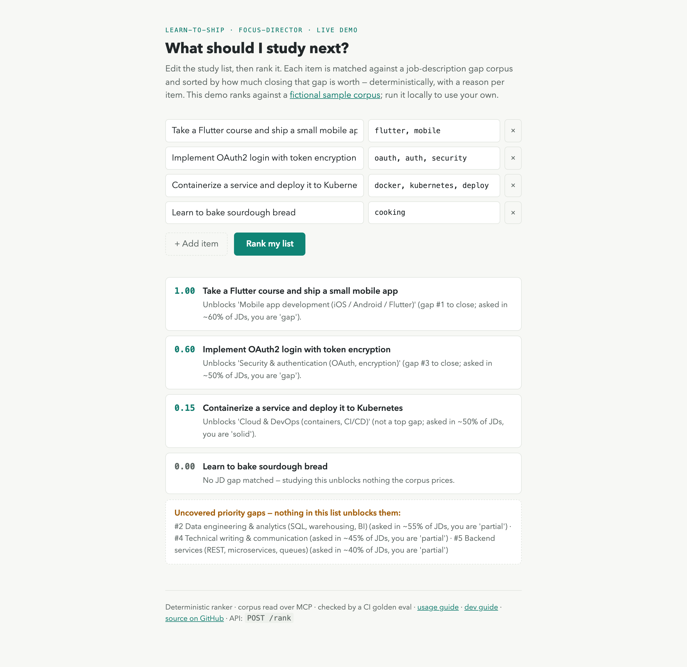

Not the most interesting thing to study, the highest-leverage one.

## The problem

I have far more things I *could* study than time to study them, and the
temptation is to learn whatever is most interesting that day. For a career
transition that's a trap: the studying feels productive but doesn't move a
hiring outcome. The question I actually need answered is narrower — *of
everything on my list, which item unblocks the most valuable gap between me
and the roles I want?* That's a **ranking against real gap data**, not a
vibe — and the answer changes as the target roles do.

## What I built

**A deterministic ranker — not an LLM call.** The agent matches each study
item to the gap it unblocks and sorts by that gap's closing-leverage
(how often the skill is demanded × how far my current level sits below it).
Same inputs → same order, every time. I ruled out an LLM ranker on purpose:
a recommendation I can't reproduce or evaluate isn't one I'd trust to steer
my own weeks — and a deterministic core is what makes the eval below
hermetic.

_The [live demo](https://vegekiwi-learn-to-ship.hf.space) ranking a study
list — a score and a reason per item, and the priority gaps nothing on the
list unblocks._

**The gap corpus is read through an MCP tool, never a file read.** The only
component that touches it is an in-repo MCP server the agent calls over a
real stdio round-trip. That seam is what lets the public demo serve a
fictional "Sample Learner" while my real data stays private behind the exact
same tool contract.

**Public agent, private data — enforced by construction.** The repo is built
in public; my career data never is. The committed corpus is a synthetic stub;
the real one is wired in via an env override and excluded from the deployed
image, and history was rewritten clean before the first push, so no private
data exists in any commit.

## Results

- **Shipped end-to-end in a day** (10 commits): a live cloud endpoint on
  Hugging Face Spaces (health check + `POST /rank`) behind a small FastAPI +
  Docker layer — deployed **free**, no paid LangGraph Platform.
- **Eval as a build gate.** A golden eval pins the full ranked order; GitHub
  Actions runs lint + eval on every push (~18s, **hermetic** — no API key, no
  network) and a ranking regression fails the build. ~874 lines of Python
  behind a 25-test suite.
- **Actually used.** I run it on my real corpus to decide what to study — the
  usage evidence a "running" claim is supposed to have, not a demo that only
  runs when someone's watching.

## What I'd do differently

In v0 the ranker is a single deterministic node — LangGraph is doing almost
nothing a plain function couldn't, and the framework only earns its place in
v1, where a second graph reviews the flashcards I write against the source.
The other soft spot is the ranker itself: word-anchored keyword matching is
brittle — a study item whose title doesn't lexically overlap its gap won't
match. A semantic match would be more robust; I kept it deterministic to
preserve the hermetic eval, and next I'd add a small labeled set to measure
whether embeddings actually beat keywords before reaching for them.
