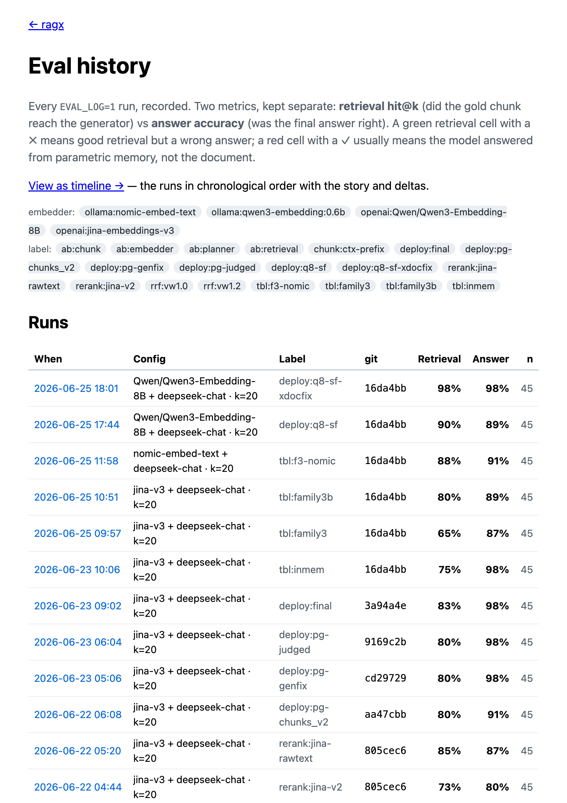

RAGX answers questions about 10-K filings — "what was Costco's 2023 revenue?" —
by finding the exact row in the right document, quoting it, and refusing to
guess when the answer isn't there.

## The problem

Annual reports run 76–365 pages, and their most valuable facts live in dense
financial tables. A wrong-but-confident answer is worse than no answer at all.
Most RAG demos hand-wave quality; RAGX takes the opposite stance — **quality is
a number, not a vibe.** I chose financial filings on purpose: the answers are
numeric and unambiguous, so the score is honest.

## What I built

**An eval harness that scores every change against the same 45 cases.** Two
metrics, kept deliberately separate: did retrieval put every needed fact in
front of the model, and was the final answer actually right (numeric-tolerant
matching, refusal detection, and an LLM judge for free-form answers). The whole
project is that scoreboard climbing:

> 0.63 / 0.78 baseline → 0.72 / 0.82 hybrid + query decomposition →
> 0.85 / 0.87 contextual retrieval + reranker → **0.97 / 0.98** with table-row
> descriptions.

_The live [`/eval` dashboard](https://ragx-rosy.vercel.app/eval) — every change
scored against the same 45 cases._

**I treated tables as the boss fight.** The biggest jump (0.82 → 0.97
retrieval) came from rewriting each numeric table row into a search-friendly
sentence at ingest time — the sentence gets embedded, the raw row is kept for
grounding and citation. That single idea is what made the numbers findable.

**Swappable seams instead of a framework.** Embedder, vector store, generator,
reranker, and planner are all interfaces with mock and real implementations, so
switching a model or a store is a one-file change. I ruled out heavyweight
orchestration until the eval proved I needed it — it never did.

## Shipped like production

**The CI pipeline runs the 45-case eval before every rollout** — below a 0.90
floor on either metric, the deploy stops and production keeps the old version.
A change that regresses retrieval quality never reaches users — that's the
MLOps claim, not just DevOps. (0.90, not today's score: LLM output varies run
to run, and a gate that cries wolf gets disabled.)

**No service-account key exists anywhere** — GitHub Actions authenticates to
GCP via Workload Identity Federation: prove an identity, exchange it for a
short-lived token. Cluster, registry, static IP, and the whole trust chain
live in Terraform, reproducible from an empty GCP project. And the one number
tuned by hand — `timeoutSec: 120` — is there because cross-document queries
*measured* 22–78s against GCP's 30s default, which cut them off as fake `502`s.

## Results

- **Retrieval 0.97, answer accuracy 0.98** on the 45-case eval — including all
  three "the answer isn't in the documents" cases, where the system says *I
  don't know* instead of hallucinating.
- **Deployed and public** on GKE Autopilot (Vercel kept as a mirror): ~10k
  chunks across four real filings (Berkshire Hathaway, JPMorgan, Microsoft,
  Costco).
- **Citations are non-negotiable** — an uncited answer is a failed answer by
  definition — and the system is wrapped as an MCP tool, so any agent can call
  it directly.
- 2,866 lines of TypeScript, 77 commits, three weeks.

## What I'd do differently

The eval harness *is* the test suite — a deliberate call, but it means the
non-quality code paths (dashboard, ingestion) have no unit tests, and "0.97"
isn't reproducible from a fresh clone without re-running paid APIs. Next time
I'd commit each eval run's JSON artifact next to the change that produced it,
and add plain unit tests around the chunker and scorer — pure functions begging
for them.

Two things the cloud layer taught me the hard way: chasing a deprecation
warning, I swapped an Ingress annotation for a field the cluster had no
resource behind — and destroyed the load balancer; the *separately reserved*
static IP is what made recovery cheap. And a credential rotation failed
silently because the pod restarted before the Secret was replaced — `envFrom`
config is a snapshot at process start, not a live subscription. The autoscaler
is also still wrong: it watches CPU, but this service saturates on network I/O
while CPU idles — the honest fix is scaling on concurrent requests.
